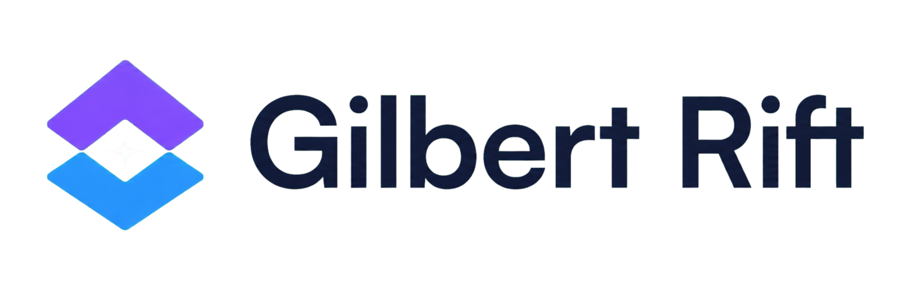
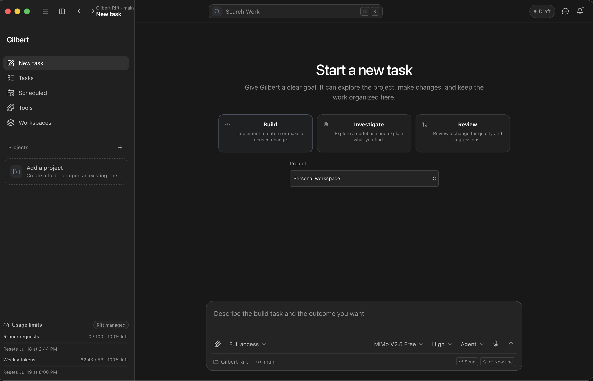
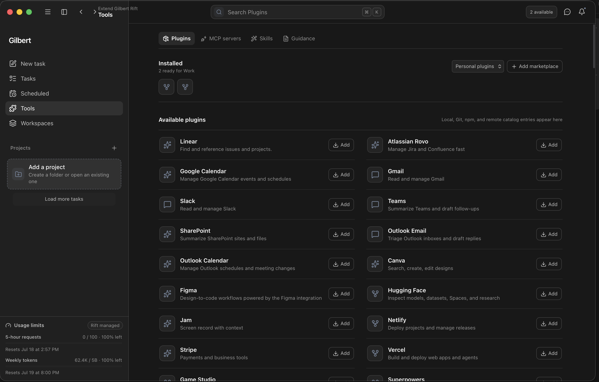
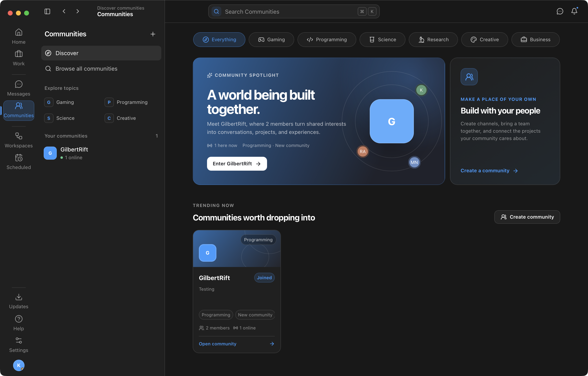

<picture>
  <source media="(prefers-color-scheme: dark)" srcset=".github/assets/gilbert-rift-logo-dark.png">
  <source media="(prefers-color-scheme: light)" srcset=".github/assets/gilbert-rift-logo-light.png">
  
</picture>

### AI work that can actually work with your project.

Code, investigate, review, collaborate, and keep the work around your work in one focused macOS app.

**Current release: 0.2.2 · macOS 13 Ventura or later**

Actual Gilbert Rift 0.2.2 interface running on macOS.

## One app for the whole arc of the work

Gilbert Rift is a desktop workspace for turning an idea into finished work without constantly
jumping between an AI chat, terminal, project browser, task tracker, messages, and team tools. Work
sessions stay grounded in a real project and keep the model, permission level, files, tool activity,
progress, and follow-ups visible in one place.

| Build with context                                                                                           | Stay in control                                                                                 |
| ------------------------------------------------------------------------------------------------------------ | ----------------------------------------------------------------------------------------------- |
| Give an AI runtime an approved project, attach files, inspect changes, and continue the same task over time. | Choose the provider, model, reasoning level, task mode, and access profile before work begins.  |
| Follow terminal activity, file reads, diffs, Git state, plans, and task progress in the timeline.            | Use approval-first, managed approval, or full-access profiles with explicit project boundaries. |

## See Gilbert Rift in action

<table>
  <tr>
    <td width="50%">
      
       
      <b>Bring your tools with you.</b> Discover plugins, inspect MCP servers, manage skills, and keep project guidance close to the work.
    </td>
    <td width="50%">
      
       
      <b>Build with people, too.</b> Communities connect conversations, channels, members, projects, events, polls, and planning.
    </td>
  </tr>
</table>

## What you can do

### Work with AI on real projects

- Start **Build**, **Investigate**, or **Review** tasks from a project-aware composer.
- Use Agent, Plan, Goal, or Goal + Plan modes for quick changes or work that spans multiple turns.
- Review tool activity, terminal output, file changes, Git status, progress steps, and generated images
  without losing the conversation that produced them.
- Queue follow-ups while work is running, stop or retry a response, and return to long-running tasks
  later.

### Choose the runtime that fits the job

- Connect supported OpenAI Codex, Anthropic Claude, OpenCode Zen, and OpenRouter runtimes.
- Discover compatible local LM Studio and Ollama servers on your device or private network.
- Select models, reasoning effort, permissions, and project scope per task instead of accepting a
  hidden global default.

### Keep collaboration beside the code

- Use direct and group messages with replies, reactions, attachments, voice notes, and presence.
- Create communities with channels, members, events, polls, planner boards, and linked projects.
- Organize workspaces, approvals, notifications, schedules, and recurring AI work from the same app.

### Feel at home on macOS

- Native window behavior, appearance-aware icons, notifications, deep links, dock badges, and launch
  settings.
- A trusted local backend keeps provider credentials and session tokens outside the webview.
- Account-scoped local project data and explicit permission profiles keep access understandable.
- Signed and verified in-app update packages make later releases available inside Gilbert Rift.

## Download and install

| Your Mac                                 | Download                                                                                                                                     |
| ---------------------------------------- | -------------------------------------------------------------------------------------------------------------------------------------------- |
| Apple silicon — M1, M2, M3, M4, or newer | [Gilbert Rift 0.2.2 for Apple silicon](https://github.com/UrbanWafflezz/GilbertRift/releases/download/v0.2.2/Gilbert-Rift-0.2.2-aarch64.dmg) |
| Intel processor                          | [Gilbert Rift 0.2.2 for Intel Mac](https://github.com/UrbanWafflezz/GilbertRift/releases/download/v0.2.2/Gilbert-Rift-0.2.2-x64.dmg)         |

1. Download the DMG for your Mac.
2. Open the DMG and drag **Gilbert Rift** into **Applications**.
3. Open **Applications**, then launch Gilbert Rift.
4. Sign in and connect the AI provider you want to use.

> [!IMPORTANT]
> **Early-access signing notice**
>
> Gilbert Rift is not currently signed with an Apple Developer ID or notarized by Apple. Signing and
> notarization are planned for a near-future release. Until then, macOS may block the first launch or
> show an unidentified-developer warning.
>
> If that happens, open **System Settings → Privacy & Security**, find the message about Gilbert Rift,
> choose **Open Anyway**, and confirm. Apple documents this process in
> [Open apps safely on your Mac](https://support.apple.com/102445). Only install builds downloaded from
> this official repository. In-app update packages are separately signed and verified; that updater
> signature is not the same as Apple Developer ID signing or notarization.

## Current release · 0.2.2

Gilbert Rift 0.2.2 improves long conversations, task lists, notifications, files, and image
performance. It also repairs expired OpenAI connection handling in the plugin catalog and strengthens
macOS window lifecycle and WebKit behavior.

[Read the 0.2.2 release notes](https://github.com/UrbanWafflezz/GilbertRift/releases/tag/v0.2.2) ·
[Browse every release](https://github.com/UrbanWafflezz/GilbertRift/releases)

Users coming from 0.1.0 need to install a current build manually once. After that, Gilbert Rift can
check for and install verified updates from inside the app.

## Requirements

- macOS 13 Ventura or later
- Apple silicon or Intel Mac
- A Gilbert Rift account
- An internet connection for account, provider, update, and collaboration features
- A supported provider sign-in or API key for the AI runtimes you choose to connect

## About this repository

This is the official public distribution home for Gilbert Rift. It contains release automation,
download metadata, and this product page; the proprietary application source is not published here.

Download Gilbert Rift only from this repository's [Releases](https://github.com/UrbanWafflezz/GilbertRift/releases)
page. For bugs and product ideas, open an [issue](https://github.com/UrbanWafflezz/GilbertRift/issues).

---

**Gilbert Rift — turn ideas into finished work.**

[Download 0.2.2](https://github.com/UrbanWafflezz/GilbertRift/releases/latest) ·
[Release notes](https://github.com/UrbanWafflezz/GilbertRift/releases/tag/v0.2.2) ·
[Report an issue](https://github.com/UrbanWafflezz/GilbertRift/issues)

