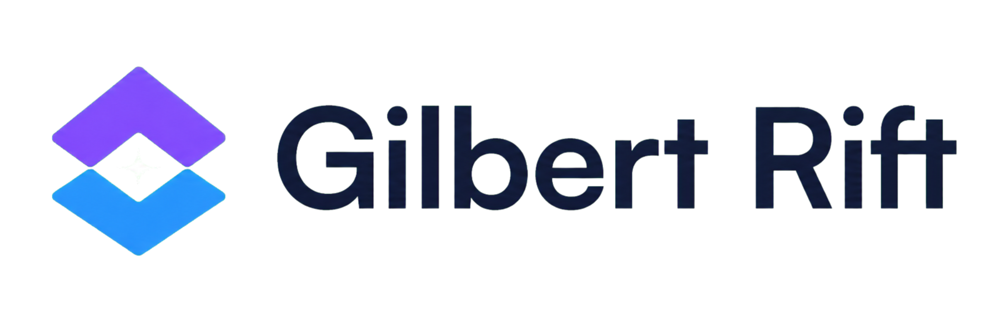
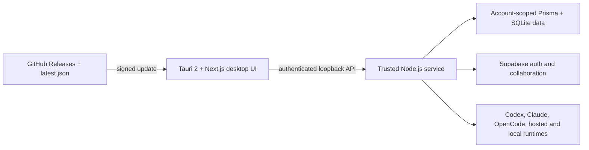

<div align="center">

<picture>
  <source media="(prefers-color-scheme: dark)" srcset=".github/assets/gilbert-rift-logo-dark.png">
  <source media="(prefers-color-scheme: light)" srcset=".github/assets/gilbert-rift-logo-light.png">
  
</picture>

### Official desktop distribution and update infrastructure

[](https://github.com/UrbanWafflezz/GilbertRift/releases/latest)
[](https://github.com/UrbanWafflezz/GilbertRift/actions/workflows/publish-desktop-update.yml)


</div>

## Repository purpose

This public repository is the release boundary for Gilbert Rift. It contains the GitHub Actions
workflow that assembles the desktop application, the signed update metadata consumed by installed
clients, public release artifacts, issue tracking, and distribution documentation.

The proprietary frontend and trusted backend source live in separate private repositories. Product
downloads are presented through the Gilbert Rift website; GitHub Releases remains the authoritative
artifact store and stable in-app update channel.

| Channel                                                                                                             | Role                                                                       |
| ------------------------------------------------------------------------------------------------------------------- | -------------------------------------------------------------------------- |
| [Latest release](https://github.com/UrbanWafflezz/GilbertRift/releases/latest)                                      | macOS and Linux downloads, checksums, and release notes                    |
| [`latest.json`](https://github.com/UrbanWafflezz/GilbertRift/releases/latest/download/latest.json)                  | Signed Tauri updater manifest read by installed AppImage and macOS clients |
| [Publish desktop update](https://github.com/UrbanWafflezz/GilbertRift/actions/workflows/publish-desktop-update.yml) | Controlled multi-platform build, signing, verification, and publication    |
| [Issues](https://github.com/UrbanWafflezz/GilbertRift/issues)                                                       | Public bug reports and product feedback                                    |

## Current release: 0.8.5

Version 0.8.5 adds the first supported Linux desktop release. The same trusted local backend, Work
terminal, native notifications, file integration, background-task controls, signed update UI, and
desktop window behavior now run on 64-bit Intel and AMD Linux systems.

- The portable `x86_64.AppImage` runs across supported distributions and receives signed in-app
  updates through `latest.json`.
- The `amd64.deb` installs through APT on Ubuntu, Debian, Linux Mint, Pop!_OS, and compatible
  distributions. Fedora-family and other distributions use the AppImage.
- Linux ARM64 is planned for a later release. Windows support is coming soon.

[Read the complete 0.8.5 release notes](https://github.com/UrbanWafflezz/GilbertRift/releases/tag/v0.8.5)

## Download and install

First check the machine architecture:

```bash
uname -m
```

Version 0.8.5 supports `x86_64`. Debian tools call that same architecture `amd64`. If the command
prints `aarch64` or `arm64`, use the web version for now and wait for the later Linux ARM release.

### Linux AppImage — recommended portable download

The AppImage is the best choice for most x86_64 Linux systems and is the Linux format supported by
Gilbert Rift's in-app updater.

```bash
mkdir -p "$HOME/.local/bin"
curl -fL \
  -o "$HOME/.local/bin/Gilbert-Rift.AppImage" \
  https://github.com/UrbanWafflezz/GilbertRift/releases/download/v0.8.5/Gilbert-Rift-0.8.5-linux-x86_64.AppImage
chmod +x "$HOME/.local/bin/Gilbert-Rift.AppImage"
"$HOME/.local/bin/Gilbert-Rift.AppImage"
```

Keep the AppImage in a user-writable location such as `~/.local/bin`; the updater replaces that file
in place after verifying its Tauri signature. Downloading a newer AppImage manually is also safe.

### Ubuntu, Debian, Linux Mint, Pop!_OS, and derivatives

Use the native `amd64.deb` for an application-menu entry and package-manager ownership:

```bash
curl -fLO \
  https://github.com/UrbanWafflezz/GilbertRift/releases/download/v0.8.5/Gilbert-Rift-0.8.5-linux-amd64.deb
sudo apt install ./Gilbert-Rift-0.8.5-linux-amd64.deb
```

Upgrade a DEB installation by downloading the newer DEB and running `sudo apt install ./<file>.deb`
again. Do not use the in-app AppImage installer for a DEB-managed copy; APT owns that installation.
Remove it with `sudo apt remove gilbert-rift`.

Fedora, RHEL, Rocky Linux, AlmaLinux, Arch, openSUSE, and other non-Debian distributions should use
the AppImage instructions above.

### Verify a download

Every release includes `SHA256SUMS.txt`. Download it beside the installer, then run:

```bash
sha256sum --ignore-missing --check SHA256SUMS.txt
```

The selected file must report `OK`. In-app updates additionally verify the artifact against the
updater public key compiled into Gilbert Rift.

### macOS

Apple silicon Macs running macOS 13 or newer should download the `macOS-aarch64.dmg`, open it, and
drag Gilbert Rift to Applications. Intel Macs are not supported after version 0.3.1.

> [!NOTE]
> **Windows is coming soon.** Version 0.8.5 does not include a Windows installer.

## Runtime architecture


```mermaid
flowchart LR
    UI["Tauri 2 + Next.js desktop UI"] -->|authenticated loopback API| Service["Trusted Node.js service"]
    Service --> Data["Account-scoped Prisma + SQLite data"]
    Service --> Supabase["Supabase auth and collaboration"]
    Service --> Providers["Codex, Claude, OpenCode, hosted and local runtimes"]
    Releases["GitHub Releases + latest.json"] -->|signed update| UI
```

The webview never receives provider credentials or durable session secrets. Filesystem, database,
provider-runtime, and authentication operations stay behind the trusted loopback service. Local
records and runtime state are separated by authenticated account.

## Release pipeline

The `Publish desktop update` workflow accepts a stable version, source scope, immutable frontend and
backend refs, and user-facing release notes. It then:

1. Checks out both private source repositories with read-only deploy keys.
2. Installs locked dependencies with Node.js 22.13 and prepares macOS aarch64 and Linux x86_64.
3. Verifies the Supabase, GIPHY, and updater-signing credentials.
4. Synchronizes the release version across JavaScript, Rust, and Tauri metadata.
5. Builds each Tauri application with its architecture-matched backend embedded in the bundle.
6. Produces the DMG, AppImage, DEB, signatures, and SHA-256 checksums.
7. Validates signed `darwin-aarch64` and `linux-x86_64` updater entries and requires the Linux URL
   to end in `.AppImage`, never `.deb` or `.rpm`.
8. Publishes the release only after every verification succeeds.

Failed or partial builds remain unpublished, so installed clients never discover an incomplete
update. Published tags and artifacts are immutable; corrections use a higher semantic version.

## Platform and update support

- macOS 13 Ventura or newer
- Apple silicon (`aarch64`) only
- Linux x86_64/amd64 on distributions compatible with the Ubuntu 22.04 build baseline
- AppImage in-app updates; DEB upgrades remain owned by APT
- Linux ARM64 planned for a later release
- Windows support coming soon
- Version 0.3.1 was the final Intel-compatible build
- Signed Tauri updater archives for in-app installation
- Existing 0.1.0 installations require one manual upgrade before in-app updates become available

The updater signature verifies artifact integrity and channel authenticity. It is separate from an
Apple Developer ID signature and notarization. Until Developer ID distribution is enabled, macOS
may require the user to approve the first launch through **System Settings → Privacy & Security**.

## Source, licensing, and support

This repository does not publish the Gilbert Rift application source. Gilbert Rift, its binaries,
branding, documentation, and release assets are proprietary software. Downloading an official build
does not grant permission to copy, modify, redistribute, commercialize, or create derivative works.
See [LICENSE.md](LICENSE.md) for the complete terms.

- [Release history](https://github.com/UrbanWafflezz/GilbertRift/releases)
- [Report a bug or request a feature](https://github.com/UrbanWafflezz/GilbertRift/issues)
- [Security guidance](https://github.com/UrbanWafflezz/GilbertRift/security)
