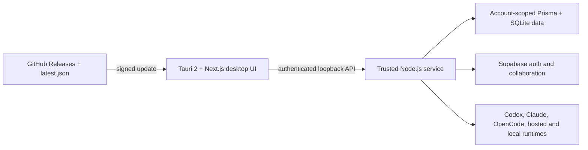

<picture>
  <source media="(prefers-color-scheme: dark)" srcset=".github/assets/gilbert-rift-logo-dark.png">
  <source media="(prefers-color-scheme: light)" srcset=".github/assets/gilbert-rift-logo-light.png">
  
</picture>

### Official desktop distribution and update infrastructure

## Repository purpose

This public repository is the release boundary for Gilbert Rift. It contains the GitHub Actions
workflow that assembles the desktop application, the signed update metadata consumed by installed
clients, public release artifacts, issue tracking, and distribution documentation.

The proprietary frontend and trusted backend source live in separate private repositories. Product
downloads are presented through the Gilbert Rift website; GitHub Releases remains the authoritative
artifact store and stable in-app update channel.

| Channel | Role |
| --- | --- |
| [Latest release](https://github.com/UrbanWafflezz/GilbertRift/releases/latest) | Published macOS package, updater archive, signatures, and release notes |
| [`latest.json`](https://github.com/UrbanWafflezz/GilbertRift/releases/latest/download/latest.json) | Tauri updater manifest read by installed clients |
| [Publish desktop update](https://github.com/UrbanWafflezz/GilbertRift/actions/workflows/publish-desktop-update.yml) | Controlled build, signing, verification, and publication pipeline |
| [Issues](https://github.com/UrbanWafflezz/GilbertRift/issues) | Public bug reports and product feedback |

## Current release: 0.4.0

Version 0.4.0 improves the conversation stack, desktop notification delivery, session resilience,
large-account operations, and bounded runtime behavior across Chat, Work, schedules, and
collaboration.

### Desktop and messaging

- macOS notifications now cover messages, mentions, task updates, and calls through one native
  bridge. Notification destinations are restricted to validated in-app routes.
- Quiet hours default to off. Existing accounts that still use the untouched shipped window are
  migrated, while user-configured schedules are preserved.
- Message threads group consecutive messages by author, add day boundaries, keep delivery state on
  the newest outgoing message, and reserve attachment dimensions to avoid layout shifts.
- Folders can be sent as traversal-safe ZIP archives and browsed as an expandable tree directly in
  the conversation.
- Group calls expose per-participant speaking state, and desktop notification audio resumes safely
  when WebKit starts with a suspended audio context.

### Chat, Work, and runtime behavior

- Gilbert Chat coalesces streamed text and reasoning updates on a fixed interval, reducing render
  pressure without delaying terminal events.
- Chat turns are serialized per conversation and have explicit cancellation and provider-stall
  handling.
- Work task presentation loads a bounded recent run window and paginates events instead of scaling
  initial rendering with the complete task history.
- Terminal sessions enforce a reconnect grace period and retain only a bounded replay window after
  exit.
- Provider catalogs, usage reporting, approvals, cancellation, and task-state presentation were
  tightened across Codex, Claude, OpenCode, hosted providers, and local runtimes.

### Trusted backend and data layer

- Supabase JSON Web Key Sets are cached in an owner-only local file. A temporary identity-service
  outage now returns a retryable response instead of invalidating an otherwise valid session.
- Account exports stream a ZIP archive from bounded database pages and sanitized local-file paths,
  avoiding whole-account buffering in memory.
- Realtime subscriptions share a bounded handshake and remove failed channels so unsuccessful
  subscriptions cannot leak resources.
- Community content loading uses bounded queries and shared profile/reaction resolution. Supporting
  migrations add channel-scoped access, durable bans, atomic poll votes, and bounded feed behavior.
- Schedule staleness is evaluated against each schedule's timezone and cadence, including
  daylight-saving transitions.

[Read the complete 0.4.0 release notes](https://github.com/UrbanWafflezz/GilbertRift/releases/tag/v0.4.0)

## Runtime architecture

```mermaid
flowchart LR
    UI["Tauri 2 + Next.js desktop UI"] -->|authenticated loopback API| Service["Trusted Node.js service"]
    Service --> Data["Account-scoped Prisma + SQLite data"]
    Service --> Supabase["Supabase auth and collaboration"]
    Service --> Providers["Codex, Claude, OpenCode, hosted and local runtimes"]
    Releases["GitHub Releases + latest.json"] -->|signed update| UI
```

The webview never receives provider credentials or durable session secrets. Filesystem, database,
provider-runtime, and authentication operations stay behind the trusted loopback service. Local
records and runtime state are separated by authenticated account.

## Release pipeline

The `Publish desktop update` workflow accepts a stable version, source scope, immutable frontend and
backend refs, and user-facing release notes. It then:

1. Checks out both private source repositories with read-only deploy keys.
2. Installs locked dependencies with Node.js 22.13 and prepares the Apple silicon Rust target.
3. Verifies required Supabase and updater-signing credentials.
4. Synchronizes the release version across JavaScript, Rust, and Tauri metadata.
5. Builds the Tauri application with the ARM backend embedded in the desktop bundle.
6. Signs the updater archive and uploads a draft GitHub Release.
7. Validates that `latest.json` contains a signed `darwin-aarch64` entry for the requested version.
8. Publishes the release only after every verification succeeds.

Failed or partial builds remain unpublished, so installed clients never discover an incomplete
update. Published tags and artifacts are immutable; corrections use a higher semantic version.

## Platform and update support

- macOS 13 Ventura or newer
- Apple silicon (`aarch64`) only
- Version 0.3.1 was the final Intel-compatible build
- Signed Tauri updater archives for in-app installation
- Existing 0.1.0 installations require one manual upgrade before in-app updates become available

The updater signature verifies artifact integrity and channel authenticity. It is separate from an
Apple Developer ID signature and notarization. Until Developer ID distribution is enabled, macOS
may require the user to approve the first launch through **System Settings → Privacy & Security**.

## Source, licensing, and support

This repository does not publish the Gilbert Rift application source. Gilbert Rift, its binaries,
branding, documentation, and release assets are proprietary software. Downloading an official build
does not grant permission to copy, modify, redistribute, commercialize, or create derivative works.
See [LICENSE.md](LICENSE.md) for the complete terms.

- [Release history](https://github.com/UrbanWafflezz/GilbertRift/releases)
- [Report a bug or request a feature](https://github.com/UrbanWafflezz/GilbertRift/issues)
- [Security guidance](https://github.com/UrbanWafflezz/GilbertRift/security)
