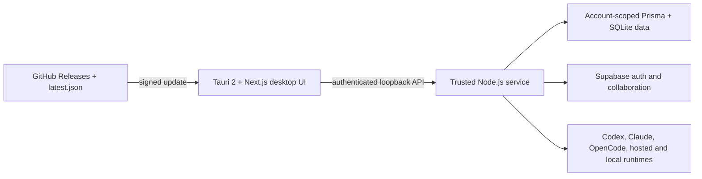

<picture>
  <source media="(prefers-color-scheme: dark)" srcset=".github/assets/gilbert-rift-logo-dark.png">
  <source media="(prefers-color-scheme: light)" srcset=".github/assets/gilbert-rift-logo-light.png">
  
</picture>

### Official desktop distribution and update infrastructure

## Repository purpose

This public repository is the release boundary for Gilbert Rift. It contains the GitHub Actions
workflow that assembles the desktop application, the signed update metadata consumed by installed
clients, public release artifacts, issue tracking, and distribution documentation.

The proprietary frontend and trusted backend source live in separate private repositories. Product
downloads are presented through the Gilbert Rift website; GitHub Releases remains the authoritative
artifact store and stable in-app update channel.

| Channel                                                                                                             | Role                                                                    |
| ------------------------------------------------------------------------------------------------------------------- | ----------------------------------------------------------------------- |
| [Latest release](https://github.com/UrbanWafflezz/GilbertRift/releases/latest)                                      | Published macOS package, updater archive, signatures, and release notes |
| [`latest.json`](https://github.com/UrbanWafflezz/GilbertRift/releases/latest/download/latest.json)                  | Tauri updater manifest read by installed clients                        |
| [Publish desktop update](https://github.com/UrbanWafflezz/GilbertRift/actions/workflows/publish-desktop-update.yml) | Controlled build, signing, verification, and publication pipeline       |
| [Issues](https://github.com/UrbanWafflezz/GilbertRift/issues)                                                       | Public bug reports and product feedback                                 |

## Current release: 0.8.0

Version 0.8.0 is Gilbert Rift's near-complete product milestone. The desktop application now keeps
long-running work alive in the background, unifies scheduled and state-triggered automation, and
finishes the core collaboration, terminal, approval, and runtime experiences required for the road
to 1.0.

### Desktop continuity

- Closing the main window can keep Gilbert Rift available from a native macOS menu-bar control,
  with explicit reopen and quit actions.
- Active Work, Scheduled, and monitoring sessions prevent macOS App Nap from silently suspending
  time-sensitive execution.
- Background task completion is surfaced through a shared in-app and native notification contract,
  with validated destinations and consistent run status.
- Desktop preferences control launch-at-login and background behavior without weakening the
  trusted local-service boundary.

### Automation and task operations

- Scheduled runs and project monitors execute through one authenticated background-session service
  and remain isolated by account.
- Tasks now separates time-triggered automation from state-triggered monitoring while preserving a
  single operational history and status vocabulary.
- Schedule destinations, ordering, run history, result rendering, deletion, and recovery behavior
  are fully manageable from the desktop client.
- Work tasks carry an explicit origin, allowing normal conversations, scheduled executions, and
  monitoring runs to be presented and resumed correctly.

### Work runtime and safety

- Work terminals now use real persistent PTY sessions, start a login shell in the selected project,
  survive panel disconnection, replay bounded output, and terminate with their owning task.
- Approval review classifies command and file operations by risk, explains why confirmation is
  required, and preserves an auditable approval history.
- OpenCode permissions are normalized into Gilbert Rift's provider-neutral access model, including
  safe handling for child sessions and interactive questions.
- Goals expose durable pause and resume behavior with explicit terminal states, while Plan decisions
  preserve revision history and stay visually anchored to the active task.
- Queued follow-ups persist across navigation and restart and can be edited, reordered, sent next,
  steered into an active response, or used to stop and replace the current response.

### Collaboration and provider infrastructure

- Communities has a refined directory, channel conversation model, member and role controls,
  invitations, polls, notification defaults, and responsive workspace layout.
- Hosted model capabilities and context limits are sourced through a maintained model catalog
  instead of relying on artificial output caps.
- Account-scoped background state, schedule reconciliation, community defaults, and task origins are
  backed by explicit schema migrations and bounded service contracts.
- Provider and runtime behavior remains isolated behind the trusted backend for Codex, Claude,
  OpenCode, hosted APIs, and local models.

The core product is now functionally complete. The remaining work before 1.0 is focused on final
polish, production hardening, and distribution quality rather than missing primary workflows.

[Read the complete 0.8.0 release notes](https://github.com/UrbanWafflezz/GilbertRift/releases/tag/v0.8.0)

## Runtime architecture

```mermaid
flowchart LR
    UI["Tauri 2 + Next.js desktop UI"] -->|authenticated loopback API| Service["Trusted Node.js service"]
    Service --> Data["Account-scoped Prisma + SQLite data"]
    Service --> Supabase["Supabase auth and collaboration"]
    Service --> Providers["Codex, Claude, OpenCode, hosted and local runtimes"]
    Releases["GitHub Releases + latest.json"] -->|signed update| UI
```

The webview never receives provider credentials or durable session secrets. Filesystem, database,
provider-runtime, and authentication operations stay behind the trusted loopback service. Local
records and runtime state are separated by authenticated account.

## Release pipeline

The `Publish desktop update` workflow accepts a stable version, source scope, immutable frontend and
backend refs, and user-facing release notes. It then:

1. Checks out both private source repositories with read-only deploy keys.
2. Installs locked dependencies with Node.js 22.13 and prepares the Apple silicon Rust target.
3. Verifies required Supabase and updater-signing credentials.
4. Synchronizes the release version across JavaScript, Rust, and Tauri metadata.
5. Builds the Tauri application with the ARM backend embedded in the desktop bundle.
6. Signs the updater archive and uploads a draft GitHub Release.
7. Validates that `latest.json` contains a signed `darwin-aarch64` entry for the requested version.
8. Publishes the release only after every verification succeeds.

Failed or partial builds remain unpublished, so installed clients never discover an incomplete
update. Published tags and artifacts are immutable; corrections use a higher semantic version.

## Platform and update support

- macOS 13 Ventura or newer
- Apple silicon (`aarch64`) only
- Version 0.3.1 was the final Intel-compatible build
- Signed Tauri updater archives for in-app installation
- Existing 0.1.0 installations require one manual upgrade before in-app updates become available

The updater signature verifies artifact integrity and channel authenticity. It is separate from an
Apple Developer ID signature and notarization. Until Developer ID distribution is enabled, macOS
may require the user to approve the first launch through **System Settings → Privacy & Security**.

## Source, licensing, and support

This repository does not publish the Gilbert Rift application source. Gilbert Rift, its binaries,
branding, documentation, and release assets are proprietary software. Downloading an official build
does not grant permission to copy, modify, redistribute, commercialize, or create derivative works.
See [LICENSE.md](LICENSE.md) for the complete terms.

- [Release history](https://github.com/UrbanWafflezz/GilbertRift/releases)
- [Report a bug or request a feature](https://github.com/UrbanWafflezz/GilbertRift/issues)
- [Security guidance](https://github.com/UrbanWafflezz/GilbertRift/security)
